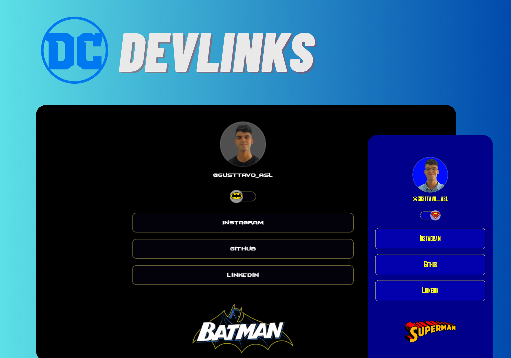

<h1 align="center"> DC-DevLinks </h1>

Cartão de visitas online inspirado nos personagens Batman e Superman  

  <a href="https://www.instagram.com/gusttavo_asl/">Instragram</a>&nbsp;&nbsp;&nbsp;|&nbsp;&nbsp;&nbsp;
  <a href="https://github.com/GustavoASL">GitHub</a>&nbsp;&nbsp;&nbsp;|&nbsp;&nbsp;&nbsp;
  <a href="https://www.linkedin.com/in/gustavo-alexandre-b45b86221/">Linkedin</a>&nbsp;&nbsp;&nbsp;

 

  

## 🧑‍💻 Tecnologias

Esse projeto foi desenvolvido com as seguintes tecnologias:

- HTML e CSS
- JavaScript
- Git e Github
- Figma

## 💻 Projeto

O DevLinks é um agregador de links para usar como cartão de visitas online.

- Feito com base nas aulas do curso discover, disponibilizado pela Rocketseat.

- [Discover](https://app.rocketseat.com.br/discover)

## 📱 Acesso

Você pode acessar o projeto atráves desse [Link](https://gustavoasl.github.io/DC-DevLinks/). 